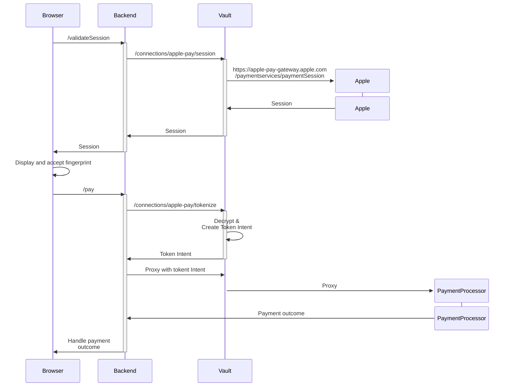
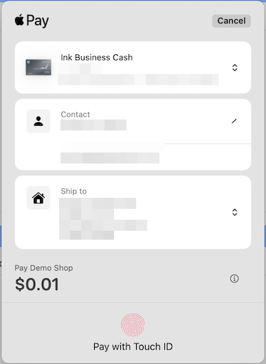
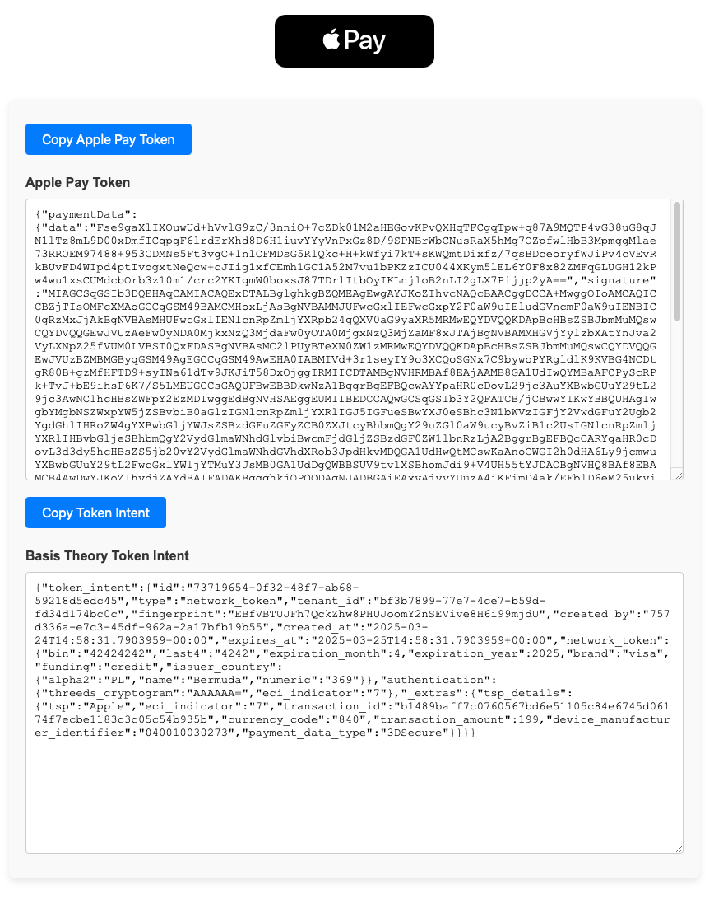

# Basis Theory Apple Pay Demo

## Prerequisites

- A method to publicly expose a website.
  - ngrok https://ngrok.com/downloads
  - localtunnel https://github.com/localtunnel/localtunnel
  - serveo https://serveo.net/
- A valid credit card in your Apple Wallet. https://support.apple.com/en-us/108398

> [!WARNING]
> These products are only listed as examples.
> Basis Theory does not endorse these services.
> Please do your own due diligence before utilizing any of the above products.

## Running the Demo Website

Be sure to review the [guide](https://developers.basistheory.com/docs/guides/apple-pay/local-developer) in our documentation for more details.

1. Clone the repo
1. Set the BT_API_KEY environment variable to your public application.
   `export BT_API_KEY=key_prod_us_pub_...`
1. Run `npm install`
1. Run `npm start` to start the local development server on port `8080`.
1. Expose the site publicly.
   - ngrok: `ngrok http http://localhost:8080`
   - localtunnel: `lt --port 8000`
   - serveo: `ssh -R 80:localhost:8080 serveo.net`
1. Add the public domain to your tenant using the [Customer Portal](https://portal.basistheory.com/settings?tab=connections) or the [API](https://developers.basistheory.com/docs/api/connections/apple-pay#register-domain-address)
1. Navigate to the public address in Safari
    > [!IMPORTANT]
    > The fingerprint scanner must be available. Meaning your macbook lid must be open.
    > Otherwise, the payment modal will not show.
1. Click the "Apple Pay" button
   - The payment modal should appear
   - 
1. Scan your fingerprint
1. The apple pay token and token intent data should populate in the textareas
    - 

## Clean-up

- Return to the Settings/Connections tab in Customer Portal
  - https://portal.basistheory.com/settings?tab=connections
- Delete any invalid domain from your tenant